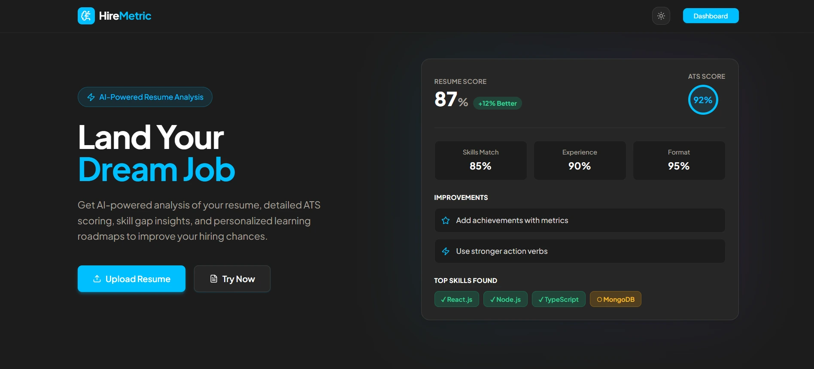
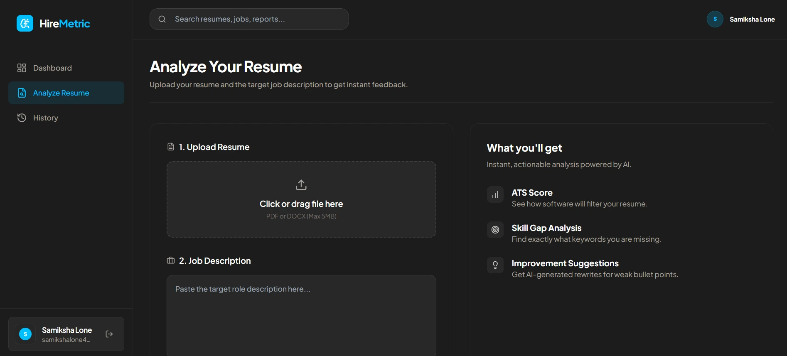
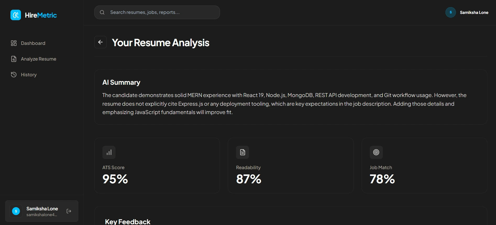

# Resume Analyzer

AI-powered resume analysis tool that evaluates resumes against job descriptions, provides ATS compatibility scores, and generates personalized learning roadmaps to improve candidacy.

## 🔗 Links

- **Live Demo**: [Coming Soon]
- **GitHub Repository**: [https://github.com/Samiksha-Lone/resume-analyzer](https://github.com/Samiksha-Lone/resume-analyzer)

## 📋 Problem Statement

In today's competitive job market, job seekers face significant challenges in optimizing their resumes. Traditional resume advice is often generic and vague, focusing on superficial changes like "use strong verbs" without addressing core issues. Many candidates struggle with:

- Understanding how Applicant Tracking Systems (ATS) parse and score resumes
- Identifying specific skill gaps compared to job requirements
- Measuring the authenticity and impact of their resume content
- Tracking progress and improvements over time

This leads to wasted applications, missed opportunities, and frustration in the job search process.

## 🗺️ Problem–Solution Mapping

| Problem | Solution |
|---------|----------|
| Generic resume advice | AI-powered specific feedback on content, tone, and technical depth |
| ATS compatibility issues | Automated ATS scoring and parsing analysis |
| Unidentified skill gaps | Resume-job description matching with gap identification |
| Lack of progress tracking | Analysis history with version comparison |
| No personalized improvement plans | AI-generated learning roadmaps |

## 🔧 What is Implemented

The Resume Analyzer implements a comprehensive analysis pipeline that combines multiple AI and algorithmic approaches:

**Resume Processing**: Extracts text from PDF and DOCX files using specialized libraries (pdf-parse, mammoth) with robust error handling.

**Multi-layered Analysis**:
- **Keyword Matching**: TF-IDF based skill extraction and cosine similarity scoring
- **ATS Compatibility**: Structural analysis for standard sections and contact information parsing
- **Reality Check**: Detection of AI-generated content patterns vs. human writing styles
- **Semantic Analysis**: AI-powered deep analysis using local Ollama models

**Scoring System**: Combines multiple metrics into readiness, match, and authenticity scores with percentile ranking against anonymized user data.

**Learning Integration**: Generates personalized 2-week improvement plans based on identified gaps.

**Data Management**: Secure user authentication, resume storage, and analysis history with MongoDB.

## 🏗️ Solution Overview

The application follows a modern full-stack architecture:

**Backend (Node.js/Express)**: Handles file uploads, text extraction, AI processing, and database operations. Uses async job queues for long-running AI tasks to prevent blocking.

**Frontend (React)**: Provides an intuitive dashboard interface with drag-and-drop uploads, real-time analysis status, and interactive results visualization.

**AI Integration (Ollama)**: Local language model processing ensures privacy and cost-effectiveness compared to cloud APIs.

**Database (MongoDB)**: Stores user data, resumes, and analysis results with proper indexing and aggregation for percentile calculations.

## ⭐ Project Highlights

- **Dual AI Support**: Local Ollama + Cloud OpenAI with automatic fallback
- **Privacy-First**: Local processing by default, cloud option for production
- **Multi-Algorithm Scoring**: Combines traditional NLP with AI for comprehensive analysis
- **Real-Time Processing**: Async job queues handle AI analysis without blocking UI
- **Scalable Architecture**: Modular design allows easy addition of new analysis features
- **Production-Ready**: Includes authentication, error handling, and logging

## ✨ Features

- 📄 **Resume Upload**: Support for PDF and DOCX formats with file validation
- 🤖 **AI Analysis**: Local LLM-powered content and tone analysis
- 🎯 **Skill Matching**: Automated comparison against job descriptions
- 📊 **ATS Scoring**: Compatibility analysis for applicant tracking systems
- 📈 **Progress Tracking**: Historical analysis with version comparison
- 🎓 **Learning Roadmaps**: Personalized improvement plans
- 🔒 **Secure Authentication**: JWT-based user management
- 📱 **Responsive Design**: Mobile-friendly React interface

## 📸 Screenshots







## 🛠️ Tech Stack

### Frontend
- **React** - Component-based UI framework
- **Tailwind CSS** - Utility-first CSS framework
- **Vite** - Fast build tool and development server
- **React Router** - Client-side routing

### Backend
- **Node.js** - JavaScript runtime
- **Express.js** - Web framework for APIs
- **MongoDB** - NoSQL database
- **Mongoose** - ODM for MongoDB

### AI & Analysis
- **Ollama** - Local language model integration (default)
- **OpenAI** - Cloud AI processing (production option)
- **pdf-parse** - PDF text extraction
- **mammoth** - DOCX text extraction

### Other Tools
- **JWT** - Authentication tokens
- **bcrypt** - Password hashing
- **Multer** - File upload handling
- **Winston** - Logging framework

## 🚀 Installation / Setup Steps

### Prerequisites
- Node.js (v16 or higher)
- MongoDB (local or cloud instance)
- Ollama (for AI analysis)

### Backend Setup
```bash
cd backend
npm install
cp .env.example .env  # Configure environment variables
npm run dev
```

### Frontend Setup
```bash
cd frontend
npm install
npm run dev
```

### AI Setup
Choose your AI provider:

**For Local AI (Ollama - Default):**
```bash
# Install and start Ollama
ollama serve

# Pull a model
ollama pull llama2
```

**For Cloud AI (OpenAI - Production):**
```bash
# Get API key from https://platform.openai.com/api-keys
# Add OPENAI_API_KEY to your .env file
# Set AI_PROVIDER=openai in .env
```

### Environment Configuration
Create `.env` file in backend directory:
```env
PORT=3000
MONGO_URI=mongodb://127.0.0.1:27017/resume-analyzer
JWT_SECRET=your-secret-key
MAX_FILE_SIZE=10485760

# AI Configuration (choose one)
AI_PROVIDER=ollama  # or 'openai' for production

# Ollama (local AI - default)
OLLAMA_HOST=http://127.0.0.1:11434
OLLAMA_MODEL=llama2

# OpenAI (cloud AI - production)
OPENAI_API_KEY=your-openai-api-key-here
OPENAI_MODEL=gpt-4o-mini
```

## 📚 Key Learnings

- **Multi-Provider AI Integration**: Implementing both local and cloud AI with fallback logic
- **Algorithm Design**: Combining multiple scoring methods for comprehensive evaluation
- **Async Processing**: Managing long-running tasks with job queues
- **Full-Stack Development**: Coordinating frontend-backend-database interactions
- **Data Privacy**: Handling sensitive resume data with security best practices
- **User Experience**: Designing intuitive interfaces for complex analysis results

## 🔮 Future Improvements

- **Real-time Collaboration**: Multi-user resume review features
- **Advanced Analytics**: Deeper insights with machine learning models
- **Integration APIs**: LinkedIn and job board connections
- **Mobile App**: Native mobile application
- **Video Analysis**: Interview preparation with video feedback
- **Team Features**: HR dashboard for bulk resume processing

## 📬 Contact

**Samiksha Balaji Lone**  
📧 samikshalone2@gmail.com  
🔗 [LinkedIn](https://linkedin.com/in/samiksha-lone) | [Portfolio](https://samiksha-lone.vercel.app/)